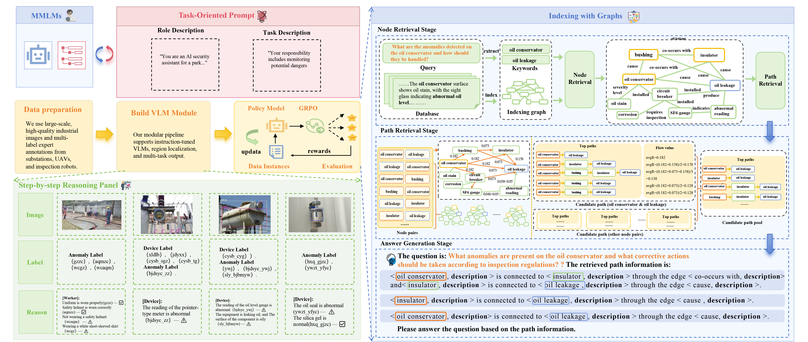
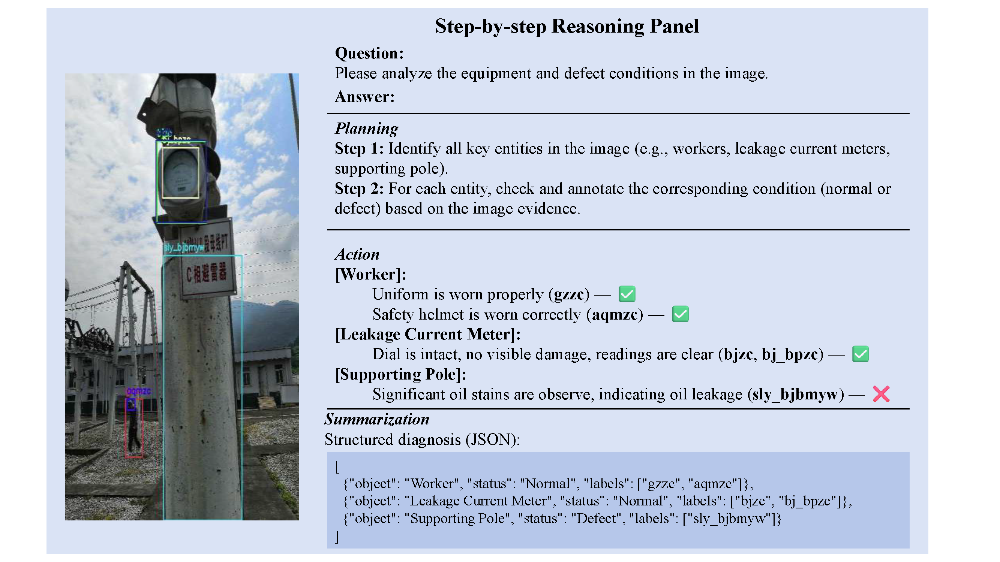
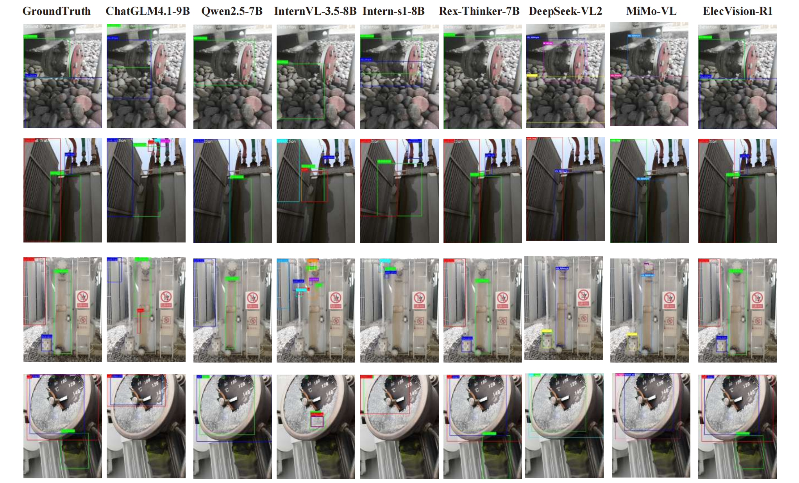
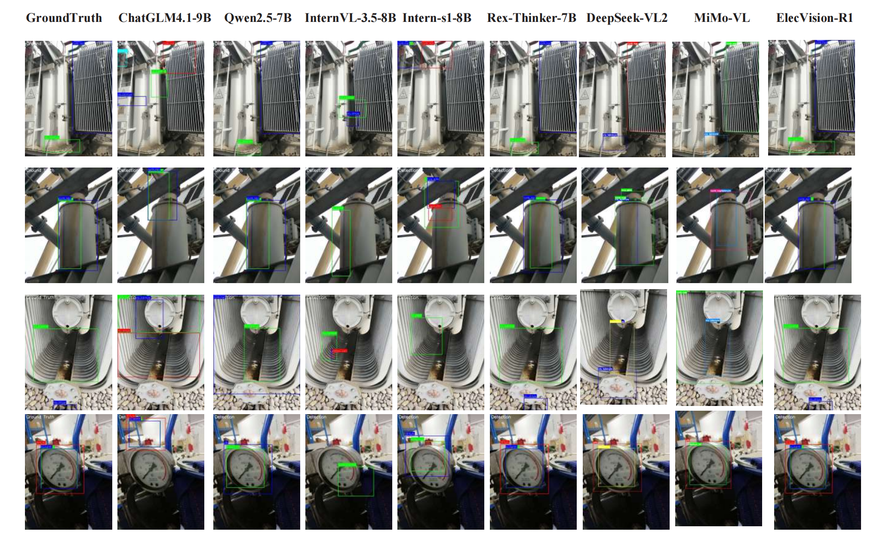
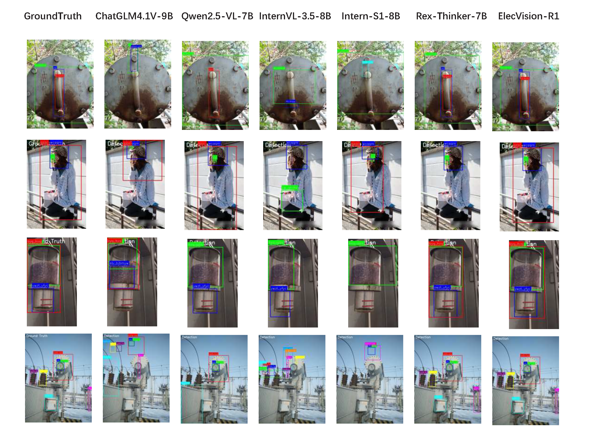
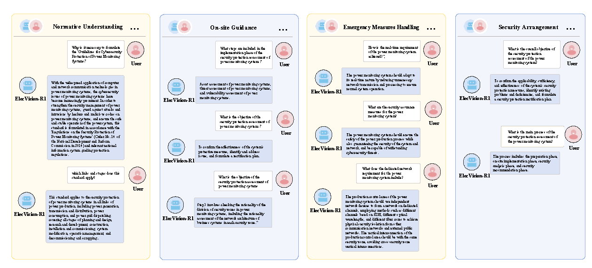
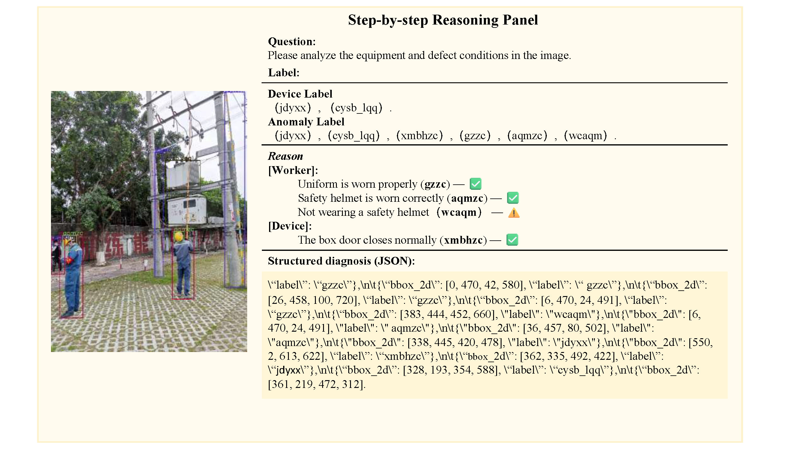
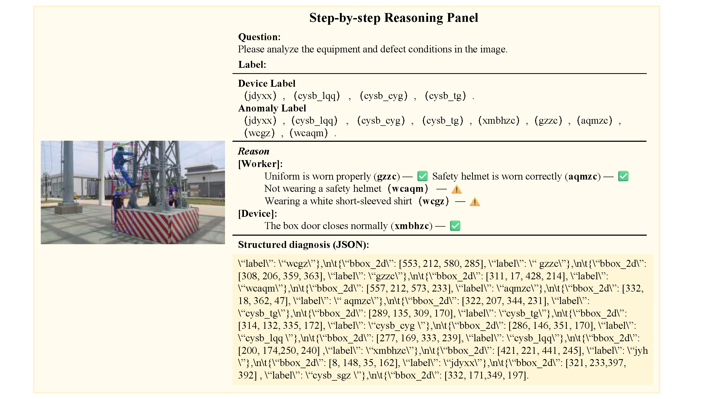
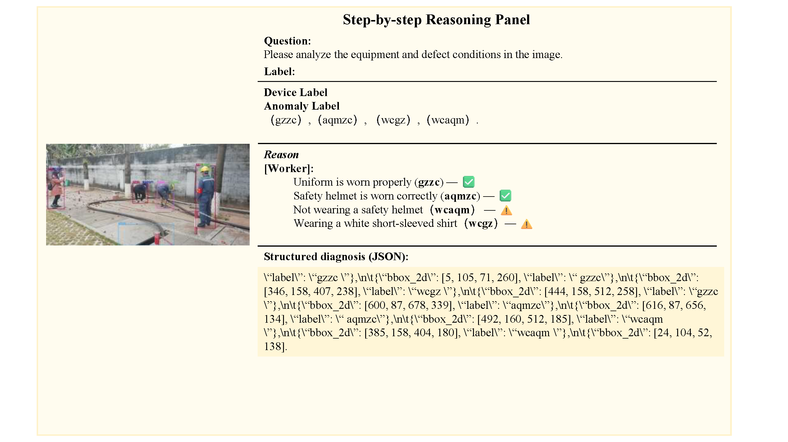
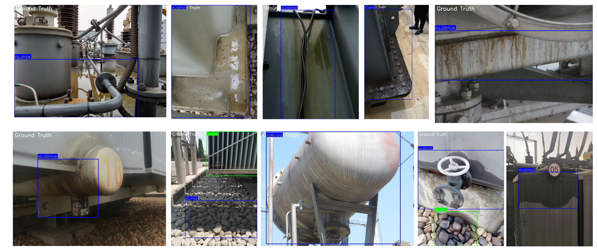

# ElecVision-R1: A Multimodal LLM-Based Framework for Image Anomaly Detection and Quality Diagnosis in Power Systems

## 📢 Latest Update

**2026.3.20:** We have open-sourced the **ElecInsp-QA-Mini dataset**. which is now available on Baidu Netdisk: https://pan.baidu.com/s/18e5R0wMXiJL_XgaIiinhmQ (access code: qsbj).

> 
Abstract: Substations are crucial components in power transmission networks, playing a vital role in ensuring system stability and safety. In recent years, intelligent inspection technologies have achieved notable progress in image recognition, anomaly detection, and multimodal modeling. However, significant challenges remain in real-world industrial settings: the scarcity of domain-specific data limits robust adaptation, complex diagnostic tasks demand explicit multi-step reasoning, and effective decision-making requires integrating structured regulatory knowledge.
</p>

To address these issues, we introduce ElecInsp-QA, a large-scale multimodal dataset for power grid inspection that contains 126,401 annotated images, paired question–answer knowledge bases, and official regulatory documents. Building on this foundation, we propose ElecVision-R1, a multimodal framework that integrates both Group Relative Policy Optimization (GRPO) and Graph-based RAG retrieval and reasoning. GRPO equips the system with structured diagnostic reasoning processes, while Graph-based RAG enables contextualized knowledge retrieval and question answering in addition to visual anomaly detection.
</p>

Validated through  benchmark experiments, ElecVision-R1 demonstrates superior performance over existing baselines, delivering interpretable diagnostics and actionable decision support. The system has been stably deployed in a provincial state-owned enterprise in China, where its effectiveness and practical value have been formally recognized by the hosting organization. Taken together, these results suggest that reinforcement-learning–assisted, knowledge-grounded multimodal systems can improve the reliability and automation of industrial inspection.
</p>


[**Paper**]() | [**Project Page**]() | [**Model Weights**]() | [**Huggingface Demo**]() |


*Figure 1) Comparative overview and the proposed system. (a) Conventional data-driven pipeline. (b) Instruction-tuned VLM pipeline. (c) ElecVision-R1: a zero/few-shot agent integrating GRPO-based policy optimization and Graph-based RAG retrieval-and-reasoning, enabling step-by-step diagnosis for power-equipment inspection and reliability assessment.*<br><br>


*Figure 2) An example of step-by-step interpretable reasoning panel generated by ElecVision-R1 during engineering deployment. The system delivers human-interpretable diagnostic chains and structured outputs, thereby supporting reliable and transparent decision-making in routine substation inspections.*<br><br>


*Figure 3) Qualitative comparison on common input scenes. Columns correspond to GroundTruth and six models; rows show four scenarios containing clutter, low contrast, and reflective materials. Our method (ElecVision-R1, rightmost) yields tighter boundaries on slender targets and fewer responses to confounders such as shadows and stains.*<br><br>


*Figure 4) Qualitative comparison on category-focused cases. Columns correspond to GroundTruth and six models; rows show exemplars with illumination changes, partial occlusions, and scale variations.*<br><br>


*Figure 5) Qualitative comparison on device-structured scenes. Columns correspond to GroundTruth and six models; rows show diverse device contexts (e.g., pressure-vessel heads, sight-glass assemblies, and pole-mounted units).*<br><br>


*Figure 6) Representative multi-turn dialogues of ElecVision-R1 across four operational scenarios: normative understanding, on-site guidance, emergency measures handling, and security arrangement, showing knowledge-grounded and actionable responses.*<br><br>


*Figure 7) Step-by-step reasoning panel: Case~1.*<br><br>


*Figure 8) Step-by-step reasoning panel: Case~2.*<br><br>


*Figure 9) Step-by-step reasoning panel: Case~3.*<br><br>


## ElecInsp-QA Dataset


*Figure 10) Examples of Oil Stains on Different Objects*<br><br>


*Figure 11) Examples of Oil Stains in Different Conditions.*<br><br>


## TODO List

- [x] Release part of ElecInsp-QA dataset. 
- [ ] Release ElecVision-R1 inference code and pretrain weights.
- [ ] Upload ElecVision-R1 training dataset.
- [ ] Release ElecVision-R1 code.


## Inference

```
python inference.py \
  --dataset ElecInsp-QA \
  --base_model Qwen2.5-VL-7B \
  --model_path ckpts/elecvision_r1 \
  --enable_rag \
  --temperature 1.0 \
  --max_new_tokens 1024
```
## Train

```
# Stage 1: supervised fine-tuning (SFT)
python train_sft.py \
  --dataset ElecInsp-QA \
  --base_model Qwen2.5-VL-7B \
  --freeze_visual true \
  --lora_r 8 \
  --lora_alpha 32 \
  --lora_dropout 0.05 \
  --max_seq_len 8192 \
  --epochs 3 \
  --lr 5e-5

# Stage 2: GRPO post-training
python train_grpo.py \
  --dataset ElecInsp-QA \
  --base_model Qwen2.5-VL-7B \
  --init_ckpt ckpts/elecvision_sft \
  --max_image_resolution 1280x784 \
  --num_generations 8 \
  --temperature 1.0 \
  --max_completion_len 1024 \
  --epochs 1 \
  --lr 1e-6 \
  --per_device_batch_size 4
